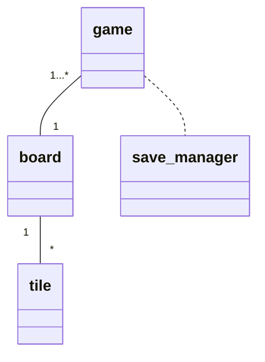

Luokkakaavio:

Sekvenssikaavio:
Ruudun arvon muutos, joka ei aiheuta virhettä pelin kannalta:

```mermaid
sequenceDiagram

main ->> Board: changeValue(location, value)
Board ->> Tile: changeValue(value)
main ->> Game: check_Board()
Game -->> main: 1
