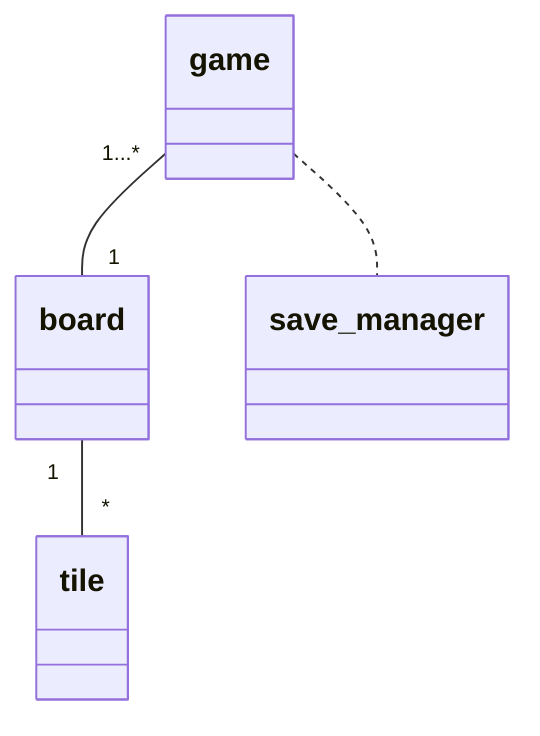

Luokkakaavio:

Sekvenssikaavio:
Ruudun arvon muutos, joka ei aiheuta virhettä pelin kannalta:

```mermaid
sequenceDiagram

main ->> Board: change_value(location, value)
Board ->> Tile: change_value(value)
main ->> Game: check_board()
Game -->> main: 1
