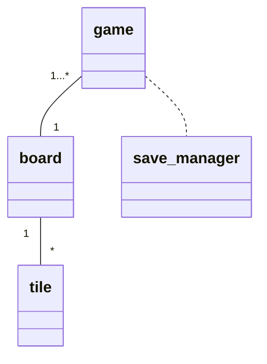
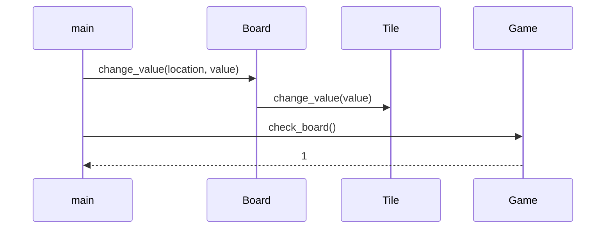
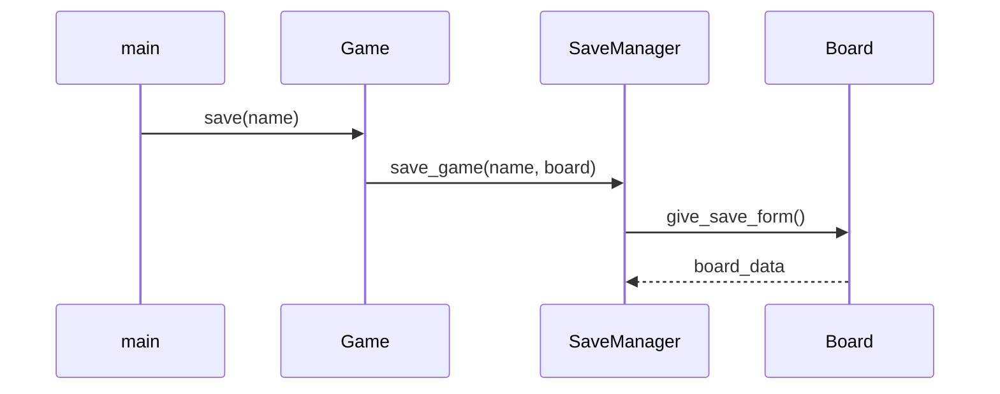
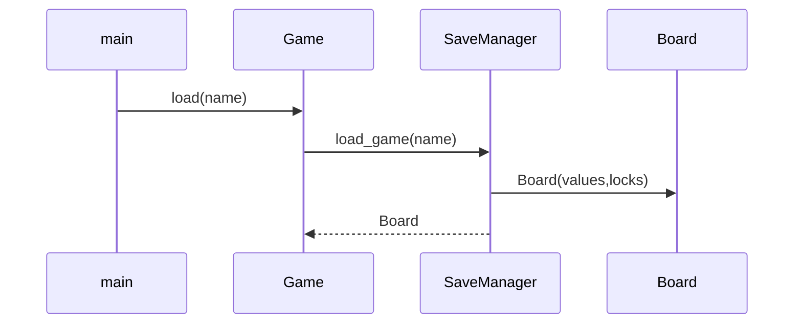

Luokkakaavio:

```mermaid
classDiagram

game "1...*"--"1" board
board "1"--"*" tile
game .. save_manager

```
Sekvenssikaavio:
Ruudun arvon muutos, joka ei aiheuta virhettä pelin kannalta:

```mermaid
sequenceDiagram

main ->> Board: change_value(location, value)
Board ->> Tile: change_value(value)
main ->> Game: check_board()
Game -->> main: 1
```
Pelin tallennus:

```mermaid
sequenceDiagram

main ->> Game:save(name)
Game ->> SaveManager: save_game(name, board)
SaveManager ->> Board: give_save_form()
Board -->> SaveManager: board_data
```
Pelin lataus

```mermaid
sequenceDiagram

main ->> Game: load(name)
Game ->> SaveManager: load_game(name)
SaveManager ->> Board : Board(values,locks)
SaveManager -->> Game: Board
```
