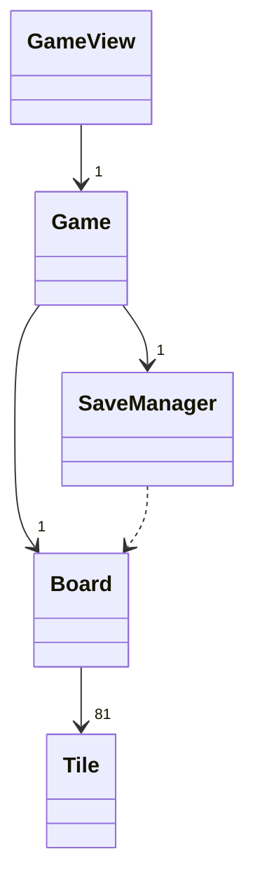
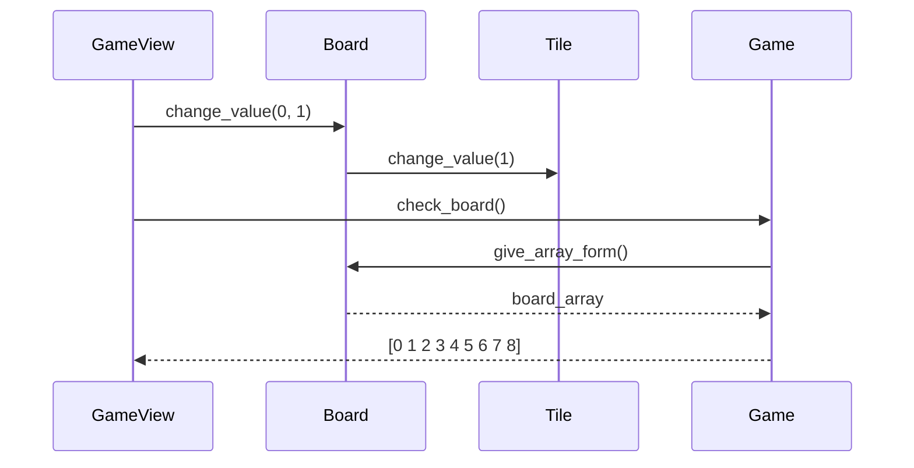
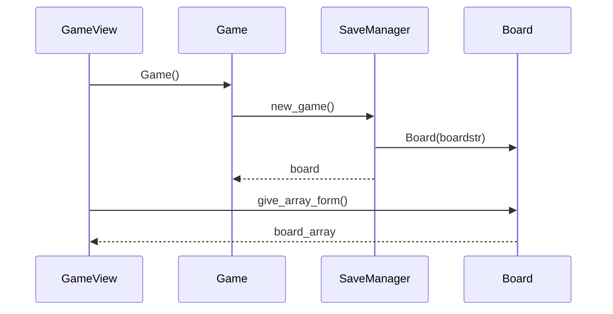
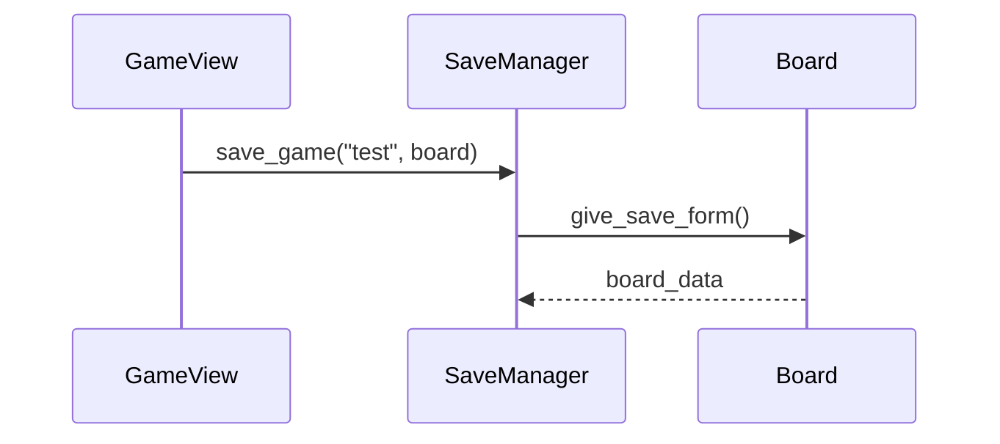
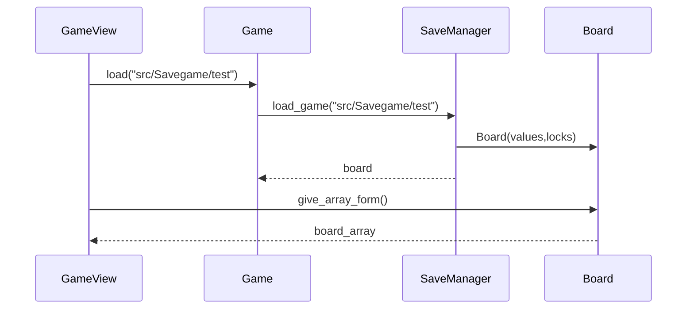
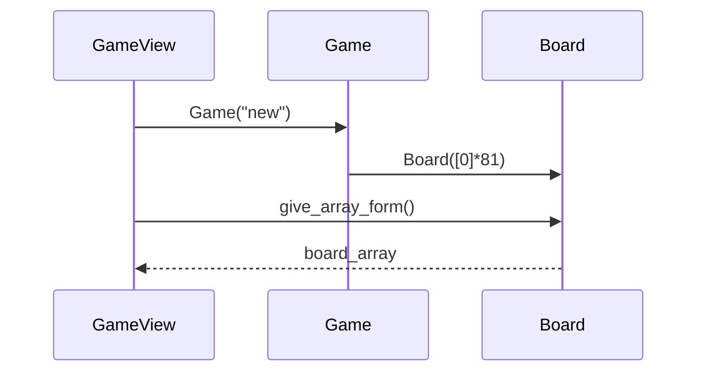
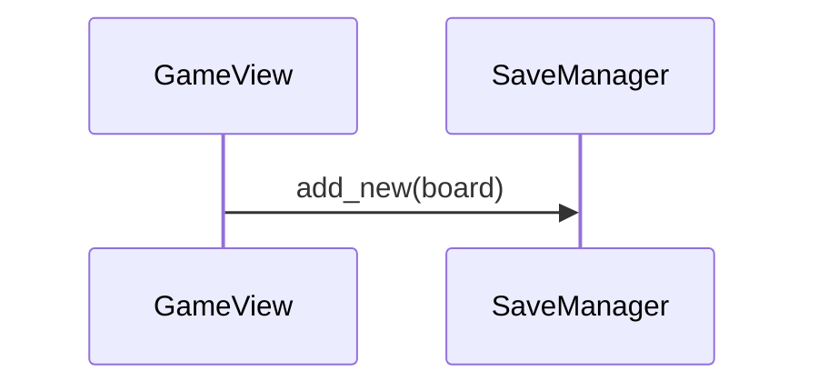

# Arkkitehtuuri
## Luokat

Luokkakaavio:

Luokka GameView vastaa visuaalisesta käyttöliittymästä.

Pelin keskeinen luokka on Game, jonka olio pitää itsellään peliä varten luokkien Board ja SaveManager olioita. Tämän lisäksi Game tarjoaa toiminnallisuuden tarkistaa lauta virheiden varalta metodilla check_game() ja raportoida niistä GameView:lle.

Luokan Board olio pitää itsessään pelilautaa, joka koostuu luokan Tile olioista. Board tarjoaa metodin muuttaa jonkin ruudukon sijainnin arvoa. Tämän lisäksi se voi metodeillaan palauttaa oman datansa eri muodoissa luokkien SaveManager, Game ja GameView käyttöön. 

Luokan Tile olio kuvaa pelinlaudan yhden ruudun sisältöä. Tile tarjoaa metodin muuttaa ruudun sisältöä Board oliolle.

Luokka SaveManager pitää vastuullaan tiedostojen käsittelyn. Se tarjoaa metodeillaan luokille Game ja GameView pelien lataus- ja tallennusmahdollisuudet.

## Toiminnallisuudet

### Numeron lisääminen
Numeron voi lisätä peliin valitsemalla laudalta ruudun ja painamalla lisättävää numeroa näppäimistöltä.
Lisätään ensimmäiseen ruutuun arvo 1, joka aiheuttaa virheen ensimmäiselle riville:

### Uuden pelin aloittaminen
Uusi peli alkaa, kun sovellus avataan tai valikon Uusi peli - komennolla.

### Pelin tallennus
Pelin voi tallentaa valikon komennolla Tallenna. Tämä avaa kansionäkymän, jossa käyttäjä voi tallentaa pelin.
Tallennus tiedostoon nimeltä test:

### Pelin lataus
Pelin lataus tapahtuu komennolla Lataa, joka avaa kansionäkymän, josta käyttäjä voi valita ladattavan tiedoston.
Pelin lataus edellä tallennetusta tiedostosta:

### Pelin luominen
Pelin luomisen voi aloittaa Pelin luonti- valikon näppäimellä Tyhjennä. Tämä luo tyhjän ruudukon seuraavasti.

Tämän jälkeen käyttäjä voi lisätä ruudukkoon numeroita normaalisti. Kun peli on halutunlainen, sen voi lisätä uusien pelien joukkoon Pelin luonti- valikon toiminnolla Tallenna uudeksi.

## Käyttöliittymä
Ohjelman käyttöliittymässä on yksi näkymä GameView, joka vastaa pelin visuaalisesta ulkonäöstä sekä ottaa vastaan käyttäjän syötteet. GameView ei itse toteuta näkymään liittymätöntä sovelluslogiikkaa vaan se kutsuu muiden luokkien metodeja luokan Game olion kautta. 
Lataus- ja tallennus tapahtuvat tiedostonäkymän sisältävien pop-up ikkunoiden kautta.

## Tiedon tallennus
Tiedon pysyväistalletus tapahtuu .txt muotoisiin tiedostoihin. 

Pelin aloitusruudukot sijaitsevat tiedostossa [src/sudoku/games.txt](../src/sudoku/games.txt), jossa jokainen rivi kuvaa yhtä aloitusruudukkoa. Tähän tiedostoon käyttäjä voi lisätä ruudukkoja pelin luomistoiminnon kautta.

Keskeneräisten pelien tallennus tapahtuu kansioon [src/Savegame](../src/Savegame), jonne jokainen peli tallennetaan omaan tekstitiedostoon muodossa ruudut+","+lukot.
