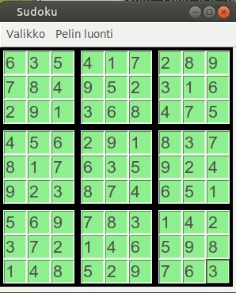

# Käyttöohje

## Asennus
1. Lataa uusin release
2. Avaa komentorivillä projektin päähakemisto
3. Asenna peli komennolla 
```
poetry install
```
Tämän jälkeen pelin voi käynnistää komennolla 
```
poetry run invoke start
```

## Pelaaminen
Pelin käynnistyksessä avautuu sudokun pelinäkymä, johon on arvottu satunnainen aloitusruudukko tiedostosta src/sudoku/games.txt:


Keltainen taustaväri ruuduissa tarkoittaa, että nämä ruudut ovat lukittuja eli käyttäjä ei voi muokata niiden sisältöä. 
Ruudukkoon voi lisätä luvun valitsemalla ensin ruudun, johon luku halutaan lisätä, ja sitten painamalla näppäimistöstä lisättävää numeroa. Ruudun voi tyhjentää käyttämällä BackSpace näppäintä tai lukua 0.


Jos peli havaitsee ruudukossa virheen, se ilmoittaa siitä värjäämällä vialliset osat punaisella. Esim. Tässä tilanteessa luvun 2 lisäys on aiheuttanut virheen, sillä kyseisellä rivillä on nyt kaksi samaa numeroa:


Kun virhe on korjaantunut, katoaa tämä värjäys.

Jos käyttäjä saa hyväksytysti pelin valmiiksi, värjääntyy koko peliruutu vihreäksi.



## Valikot
Valikon toiminnot ovat seuraavat:
 
 
 
 Uusi peli- arpoo muistista uuden pelin ja asettaa sen ruudukkoon
 
 Lataa peli- Avaa pelin latausnäkymän, josta voi ladata keskeneräisen pelin .txt muotoisesta tiedostosa.
 
 Tallenna peli- Avaa tallennusnäkymän, jossa käyttäjä voi tallentaa kesken jääneen pelin.
 
 Sulje - sulkee ohjelman
 
   
 
 Tallennuksen ja latauksen oletuskansio on kohteessa src/Savegame
 
 Pelin luomisvalikko on seuraava:
 
 
 
 Tyhjennä - Tyhjentää peliruudun, jotta käyttäjä voi vapaasti lisätä sinne lukuja. Ruudut, joihin käyttäjä lisää luvun, tulevat olemaan lukittuja, jos peli tallennetaan komennolla tallenna uudeksi.
 
  
 
 Tallenna uudeksi - Tallentaa peliruudukon datan tiedostoon src/sudoku/games.txt. Tämän jälkeen, kun käyttäjä aloittaa uuden pelin komennolla Uusi peli, voi hän saada satunnaisesti tämän luodun pelin ratkaistavakseen.
 
 
