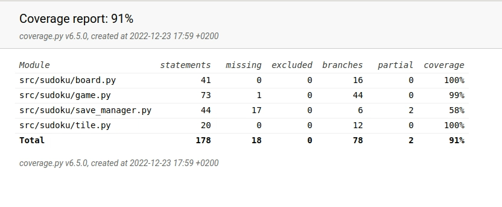

# Testausdokumentti
Sovellusta on testattu unittesteillä sekä manuaalisesti.

## Unittest
Luokkien testit:

[board](src/tests/board_test.py)

[tile](src/tests/tile_test.py)

[game](src/tests/game_test.py)

[save_manager](save_manager_test.py)

### Ruudun tarkistukset (luokka tile)
Ruudun tarkistuksissa katsotaan, että ruutujen lukitukset toimivat ja että ruudun arvon muutokset toimivat oikein.
### Ruudukon tarkistukset (luokka board)
Ruudukon tarkistuksissa tarkastellaan lähinnä luokkien board ja tile yhteistoimintaa. Tämän lisäksi tarkastetaan, että luokan board tuloste on oikea.
### Pelin tarkistusten testaus(luokka game)
Pelin tarkistuksia testataan ennaltamäärätyn board olion avulla, sillä normaalisti luokan game konstruktoria käytettäessä board on satunnainen. Testeissä board-oliota muokataan eri tavoilla ja katsotaan, että tarkistukset antavat oikean palautteen. Metodia load ei testattu, sillä se ainoastaan kutsuu luokan save_game metodia.
### Tallennus ja lataus(luokka save_manager)
Luokan save_manager toimintaa testataan luomalla unittesteissä tiedosto test.txt kansioon Savegame johon suoritetaan tiedoston lukuja/kirjoituksia. Metodia add_new ei testattu unittesteillä sivuvaikutusten vuoksi, sillä metodi lisää rivejä tiedostoon games.txt. Latauksen virhetilanteita ei myöskään tarkistettu unittestein vaan se tehtiin manuaalisesti.
### Integraatio
Luokan board testeissä testataan integraatiota luokan tile kanssa. Luokkien game ja save_manager testeissä testataan integraatiota luokan board kanssa.
### Kattavuus

Testien haaraumakattavuus on noin 91%. Testien ulkopuolelle jäivät siis edellä mainitut luokan game metodi load sekä save_manager luokan metodi add_new.  Kummankin metodin toiminta on todettu manuaalisesti.
## Järjestelmä
### Asennus
Sovellus on asennettu etäyhteydellä cubbli linuxille readme:n ohjeistuksella. 
### Pelin manuaalinen testaus
Pelin kaikki toiminnallisuudet ovat tarkistettu pelaamalla peliä graafisen käyttöjärjestelmän kautta. 
### Virhetilanteet
Pelin testauksen yhteydessä on tarkastettu ohjelman toiminta seuraavissa tilanteissa:
  - Ruutuihin syötetty peliin kuulumattomia merkkejä
  - Lataus on yritetty suorittaa tiedostosta, jossa oleva ruudukon data on vaurioitunut(eli merkkejä liikaa tai liian vähän).
  - Uuden pelin aloittaminen, jos arvotun ruudukon data tiedostossa games.txt on viallinen.
